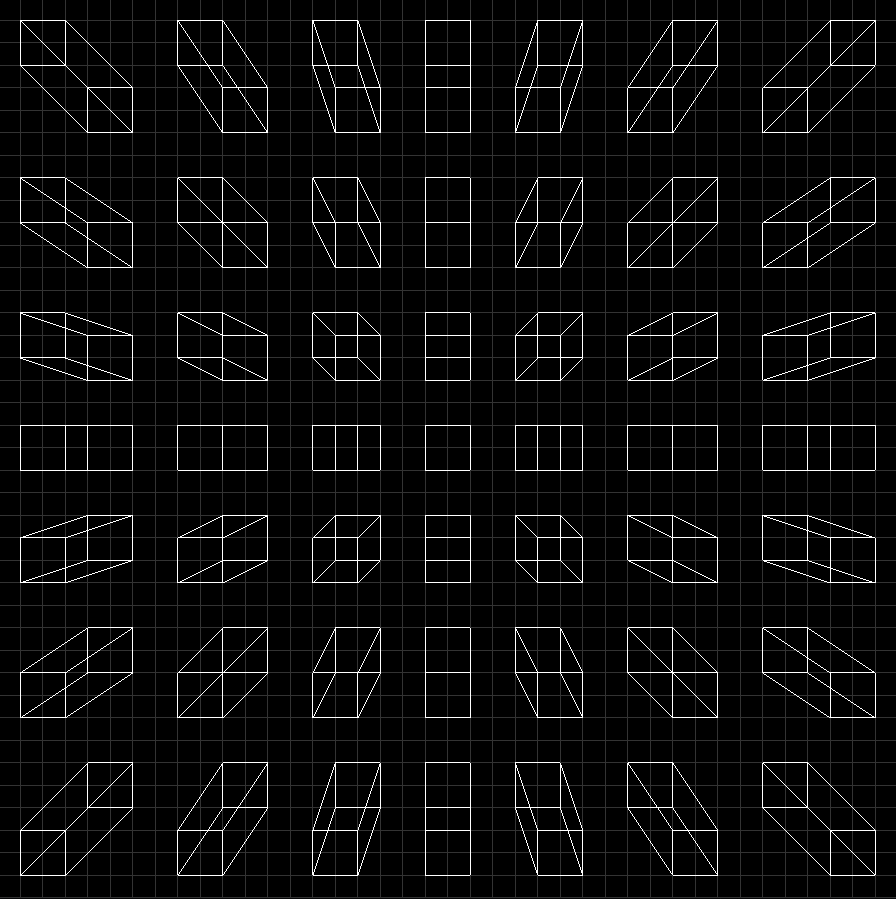
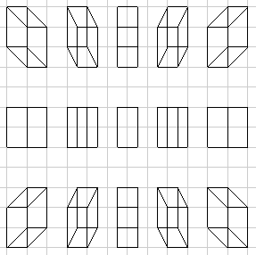
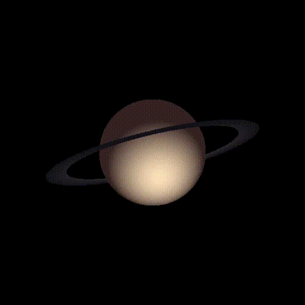
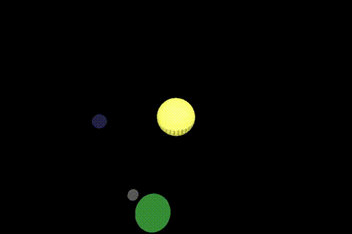
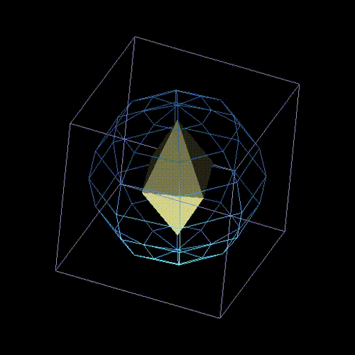
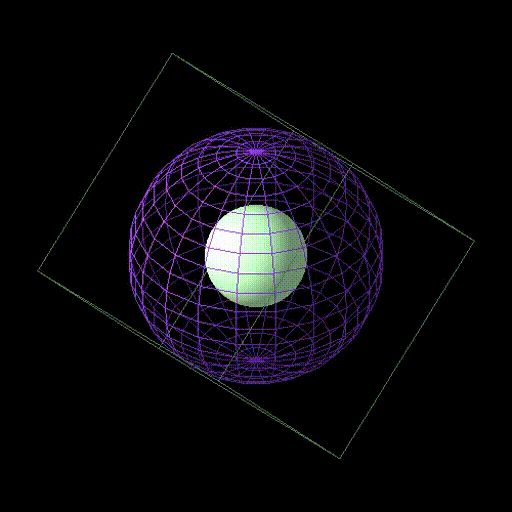
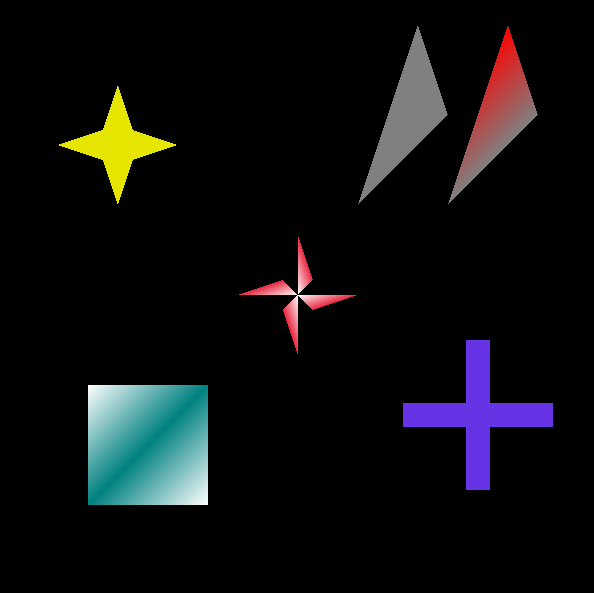
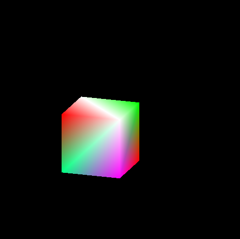
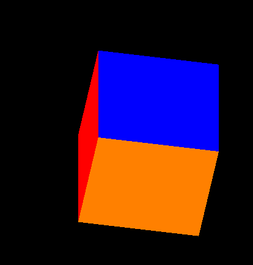

# OpenGL
Drawing few shapes in OpenGL library in C++ including lighting and material.

## How to run
```g++ <file name> -lglut -lGLU -lGL```

./a.out```

## Buildings (Or a city from above!)

idea from [here](https://pin.it/YtQbHaJ).
<p align="center">


</p>

## Fun Patterns

<p align="center">

</p>

## Saturn

Try arrow keys!
<p align="center">

</p>

## Mini Solar System

<p align="center">

</p>

## Wired shapes 1

<p align="center">

</p>

## Wired shapes 2

<p align="center">

</p>

## 2D Shapes

<p align="center">

</p>

## Colorful Cube

<p align="center">

</p>

## Simple cube

<p align="center">

